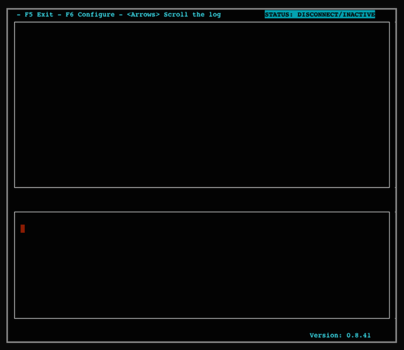
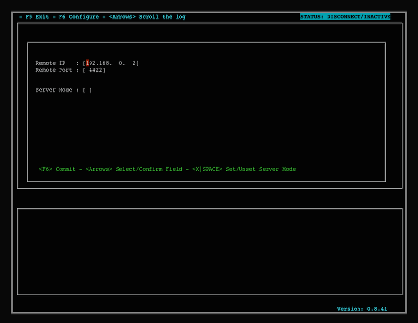
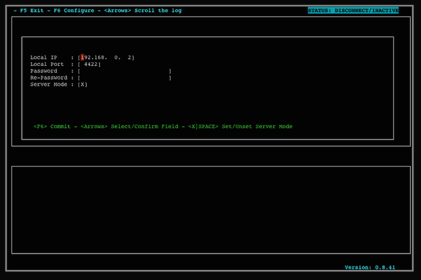

Description:
============

Securechat is a text-based client/server chat utility  that uses ssl/tls (openssl)  to establish an encrypted communication between the two parties. It wants to be a "modern" version of the talk program, the historical text chat program on Unix.

Dependencies:
=============

This program requires:

*  libssl1.0-dev 
*  libncurses5-dev

or equivalent package for your distribution.
I'm planning an upgrade to 1.1 as soon I have free time.

On OSX, an installation of openssl from sources third parties packet manager system is required.

Configuration:
==============

The program requires the generation of some certificates to operate. 

Try it live:
=============

Using this link (a Github account is required), it's possible to test this program on Gitpod:

The port 8866 is configured as available for the server mode.

* TIP: if the Gitpod terminal results to small and the program raise an errori for this reason, try to reduce the font size of your browser with "CMD -" or equivalent technique compatible with your browser.

Server Certificates Configuration:
==================================

1. Create Certification Authority: 
$ mkdir $HOME/.securechat  
$ cd $HOME/.securechat  
$ openssl req -out ca.pem -new -x509 

2. Server Private Key: 
$ openssl genrsa -out server.key 4096 

3. Certificate Request: 
$ openssl req -key server.key -new -out server.req 

4. Certificate Sequence (a progressive number):  
$ echo "11" > file.seq 

5. Public Key: 
$ openssl x509 -req -in server.req -CA ca.pem -CAkey privkey.pem -CAserial file.seq -out server.pem

5. Only the owner of the server.key and the other private archives can be able to read or modify those files, check the permissions and change it in case of wrong privileges! 
$ chmod -R 600 *  

* Note: This program support the certificate passphrase, if it is used on a shared computer, it is strongly recommended to use this feature. 

Client Certificates Configuration:
==================================

Request the server.pem certificate to the server counterpart and insert that file in: 
$HOME/.securechat/TrustStore.pem  
as explained in the man page.

Using Securechat:
=================

After the certificates configuration, start the program from the shell, for example: 
$ ./securechat  

* Note: Check the $TERM environment variable if the initial screen is not correctly printed. 

If your node has the client role, press F6 and insert in the configuration fields the IP and the port number of the remote counterpart:

If your node has the server role, press F6 , the X key and then insert in the configuration fields the IP and the port number of the remote node. If the certificates haven't a passphrase, leave the the password fields empty:

The arrows keys scroll the conversation log. The F5 key disconnects the chat and closes the program.
